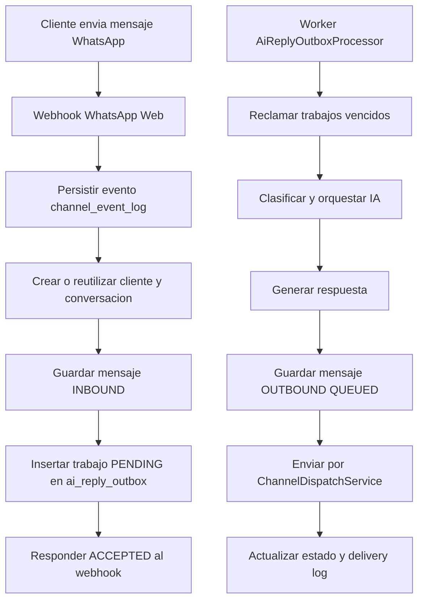

# Cambios: cola persistente / outbox para respuestas IA

## Resumen

Se incorporo una cola persistente basada en el patron outbox para desacoplar la recepcion del mensaje entrante, la orquestacion IA y el envio de respuestas automaticas por WhatsApp.

## Archivos nuevos

- `backend-java/src/main/resources/db/migration/V28__ai_reply_outbox_queue.sql`
  - Crea la tabla `ai_reply_outbox`.
  - Agrega estados `PENDING`, `PROCESSING`, `PROCESSED`, `FAILED`, `SKIPPED`.
  - Agrega restriccion unica por `business_id` + `inbound_message_id` para idempotencia.
  - Agrega indices para procesamiento pendiente y busqueda por conversacion.

- `backend-java/src/main/java/com/asistentewhatsapp/aiagents/infrastructure/AiReplyOutboxJdbcRepository.java`
  - Inserta trabajos pendientes.
  - Reclama trabajos vencidos con `FOR UPDATE SKIP LOCKED`.
  - Marca trabajos como procesados, omitidos, fallidos o reintentables.

- `backend-java/src/main/java/com/asistentewhatsapp/aiagents/application/AiReplyOutboxProcessor.java`
  - Worker programado con `@Scheduled`.
  - Ejecuta analisis estetico no bloqueante.
  - Ejecuta `AgentCoordinatorService`.
  - Envia la respuesta por `ChannelDispatchService`.
  - Actualiza `message`, `conversation` y `message_delivery_log`.
  - Reintenta con backoff exponencial cuando falla.

- `PROMPT_COLA_OUTBOX_IA.md`
  - Prompt tecnico ejecutado para incorporar la mejora.

## Archivos modificados

- `backend-java/src/main/java/com/asistentewhatsapp/channels/infrastructure/whatsappweb/WhatsAppWebWebhookService.java`
  - Antes: procesaba IA y envio dentro del webhook.
  - Ahora: persiste el mensaje entrante y encola un trabajo `ai_reply_outbox`.
  - `MESSAGE_SENT_EXTERNAL` sigue sin activar IA.

- `backend-java/src/main/resources/application.yml`
  - Agrega parametros configurables del worker outbox.

- `.env.example`, `.env.local.example`, `backend-java/.env.example`
  - Agrega variables de configuracion de la cola IA.

- `docker-compose.yml`, `docker-compose.local.yml`, `docker-compose.prod.yml`
  - Agrega variables de configuracion de la cola IA.

## Flujo nuevo



## Variables nuevas

```env
APP_AI_AGENTS_OUTBOX_WORKER_INTERVAL_MS=5000
APP_AI_AGENTS_OUTBOX_BATCH_SIZE=10
APP_AI_AGENTS_OUTBOX_PROCESSING_TIMEOUT_MS=120000
APP_AI_AGENTS_OUTBOX_RETRY_BASE_DELAY_MS=30000
APP_AI_AGENTS_OUTBOX_RETRY_MAX_DELAY_MS=900000
```

## Resultado esperado

El asistente ahora captura el mensaje recibido, lo persiste y lo encola. La IA responde con procesamiento diferido, seguro e idempotente. Esto reduce el riesgo de perder respuestas si el proveedor de IA o el canal WhatsApp falla temporalmente.
