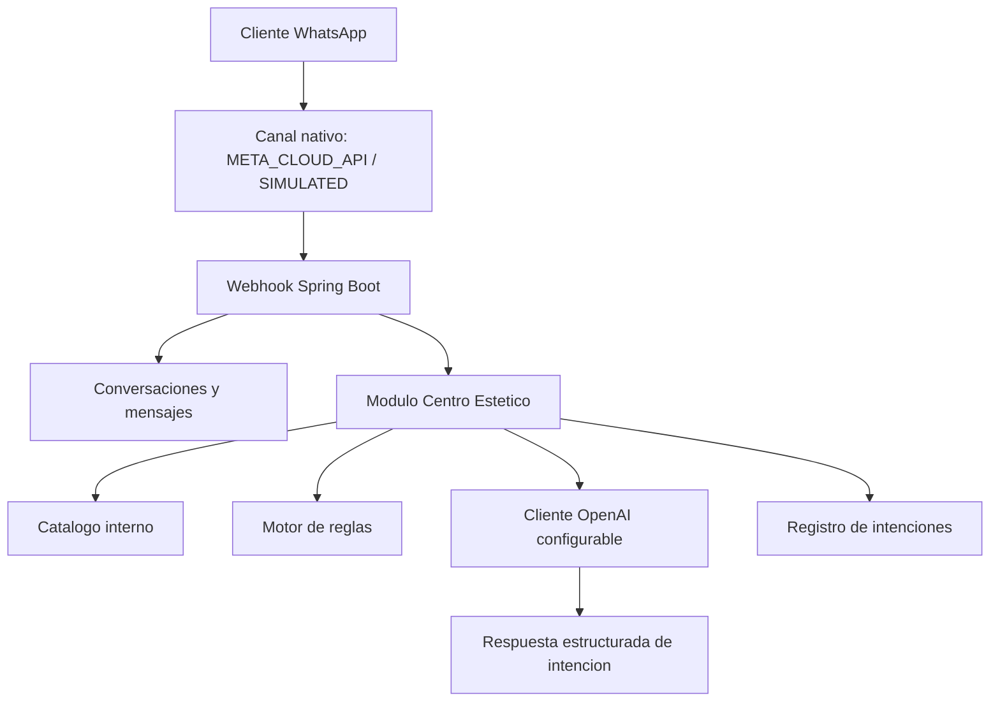
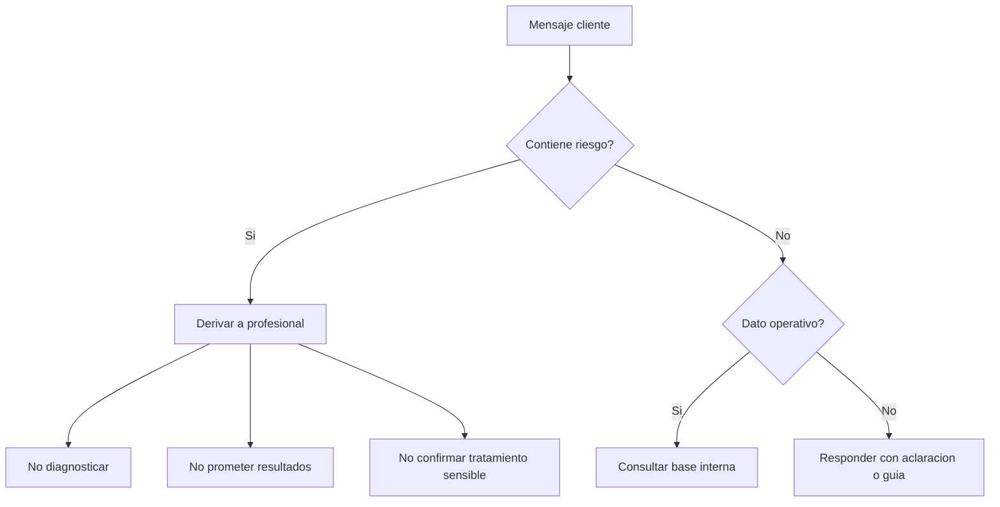

# Modulo Centro Estetico

> **ESTADO: HISTÓRICO PARCIAL.** El diagrama usaba el adaptador externo `whatsapp-web-service` (eliminado 2026-08-01); el canal es nativo del backend (`META_CLOUD_API`/`SIMULATED`).

## Objetivo

Este modulo incorpora catalogo estetico, productos, reglas de negocio, promociones, historial de tratamientos y analisis de intencion para conversaciones de WhatsApp.

## Arquitectura aplicada



## Tablas agregadas

- `aesthetic_professional`: profesionales activos y especialidad.
- `aesthetic_service_category`: categorias de servicios esteticos.
- `aesthetic_service`: servicios esteticos con duracion, precio, reglas, contraindicaciones y cuidados posteriores.
- `aesthetic_product_category`: categorias de productos.
- `aesthetic_product`: productos con precio, stock, proveedor, vencimiento y reglas de recomendacion.
- `aesthetic_business_rule`: reglas criticas centralizadas.
- `aesthetic_promotion`: promociones y condiciones comerciales.
- `aesthetic_treatment_history`: historial estetico por cliente.
- `aesthetic_intent_log`: trazabilidad de intenciones detectadas.

## Endpoints agregados

| Metodo | Ruta | Descripcion |
|---|---|---|
| GET | `/api/v1/esthetic/services` | Lista servicios esteticos con filtros. |
| GET | `/api/v1/esthetic/services/{serviceId}` | Obtiene detalle de servicio. |
| GET | `/api/v1/esthetic/products` | Lista productos con filtros y stock bajo. |
| GET | `/api/v1/esthetic/products/{productId}` | Obtiene detalle de producto. |
| GET | `/api/v1/esthetic/rules` | Lista reglas de negocio configurables. |
| POST | `/api/v1/esthetic/intent/analyze` | Analiza intencion de un mensaje. |
| GET | `/api/v1/esthetic/intent/logs` | Lista trazas de intenciones detectadas. |

## Intenciones soportadas

- `consultar_servicios_disponibles`
- `consultar_precio_servicio`
- `consultar_duracion_servicio`
- `pedir_recomendacion_tratamiento`
- `reservar_hora`
- `cancelar_reserva`
- `reprogramar_reserva`
- `consultar_productos`
- `recomendar_productos`
- `consultar_promociones`
- `consultar_disponibilidad_fecha`
- `consultar_disponibilidad_profesional`
- `consultar_contraindicaciones`
- `solicitar_cuidados_posteriores`
- `solicitar_evaluacion_estetica`
- `consultar_estado_reserva`
- `consultar_historial_cliente`
- `consultar_medios_pago`
- `derivar_atencion_humana`
- `intencion_no_clara`

## Contrato de salida de intencion

```json
{
  "intencion": "reservar_hora",
  "confianza": 0.88,
  "entidades": {
    "servicio": "Limpieza facial profunda",
    "producto": null,
    "fecha": "manana",
    "hora": "17:00",
    "profesional": null,
    "cliente": null
  },
  "requiereConsultaBaseDatos": true,
  "requiereDerivacionHumana": false,
  "motivoDerivacion": null,
  "respuestaSugerida": "Puedo ayudarte a reservar Limpieza facial profunda. Debo revisar disponibilidad antes de confirmar una hora.",
  "modelo": "gpt-5.4-mini:fallback-rules"
}
```

## Reglas de seguridad implementadas



Palabras sensibles consideradas: embarazo, lactancia, alergia, medicamentos, isotretinoina, anticoagulantes, diabetes, heridas, infeccion, fiebre, marcapasos, trombosis, cancer, dolor fuerte, sangrado, quemadura, diagnostico y enfermedad.

## Configuracion OpenAI

El modulo deja el proveedor configurado por variables de entorno. Por defecto queda deshabilitado para no exponer credenciales ni forzar consumo externo.

```yaml
app:
  ai:
    openai:
      enabled: ${APP_OPENAI_ENABLED:false}
      base-url: ${APP_OPENAI_BASE_URL:https://api.openai.com/v1/responses}
      api-key: ${APP_OPENAI_API_KEY:}
      model: ${APP_OPENAI_MODEL:gpt-5.4-mini}
      timeout-seconds: ${APP_OPENAI_TIMEOUT_SECONDS:30}
```

Si el modelo configurado no existe o no esta habilitado en la cuenta, cambia `APP_OPENAI_MODEL` por el identificador permitido por tu cuenta.

## Modo de operacion

1. Cuando llega un mensaje por WhatsApp, el webhook guarda cliente, conversacion y mensaje.
2. Luego invoca el analisis de intencion del modulo estetico.
3. Si `APP_OPENAI_ENABLED=true` y existe clave, se intenta usar OpenAI.
4. Si OpenAI no esta disponible, el sistema usa clasificacion deterministica por reglas.
5. El resultado queda registrado en `aesthetic_intent_log`.
6. Las respuestas sugeridas nunca deben inventar precios, horarios, stock ni disponibilidad.

## Ejemplos de prueba

### Precio de servicio

Mensaje:

```text
Cuanto sale la limpieza facial?
```

Resultado esperado:

```json
{
  "intencion": "consultar_precio_servicio",
  "requiereConsultaBaseDatos": true,
  "requiereDerivacionHumana": false
}
```

### Riesgo estetico

Mensaje:

```text
Estoy embarazada, puedo hacerme drenaje linfatico?
```

Resultado esperado:

```json
{
  "intencion": "derivar_atencion_humana",
  "requiereConsultaBaseDatos": true,
  "requiereDerivacionHumana": true
}
```

### Reserva

Mensaje:

```text
Quiero agendar depilacion laser manana
```

Resultado esperado:

```json
{
  "intencion": "reservar_hora",
  "requiereConsultaBaseDatos": true,
  "requiereDerivacionHumana": true
}
```

La derivacion puede ser verdadera si el servicio detectado requiere evaluacion previa o consentimiento informado.

## Archivos principales

- `backend-java/src/main/resources/db/migration/V7__aesthetic_center_module.sql`
- `backend-java/src/main/java/com/asistentewhatsapp/aesthetic/api/AestheticCenterController.java`
- `backend-java/src/main/java/com/asistentewhatsapp/aesthetic/application/AestheticCenterService.java`
- `backend-java/src/main/java/com/asistentewhatsapp/aesthetic/infrastructure/AestheticCenterJdbcRepository.java`
- `backend-java/src/main/java/com/asistentewhatsapp/aesthetic/infrastructure/openai/OpenAiIntentClient.java`
- `backend-java/src/test/java/com/asistentewhatsapp/aesthetic/api/AestheticCenterControllerTest.java`

## Supuestos

- El proyecto mantiene Spring Boot, Flyway y PostgreSQL.
- El modelo solicitado se deja como valor configurable, sin codificar credenciales.
- La respuesta final se entrega como sugerencia controlada; la confirmacion real de horarios, stock y reservas debe pasar por servicios de negocio internos.
- Los temas medicos o sensibles siempre derivan a una profesional.

## Mejoras futuras recomendadas

- Agregar pantalla administrativa especifica para reglas esteticas.
- Agregar CRUD completo para servicios, productos, promociones y profesionales.
- Agregar reglas de disponibilidad por calendario de profesional.
- Descontar insumos automaticamente al completar una cita.
- Convertir `respuestaSugerida` en respuesta saliente automatica solo despues de una aprobacion de seguridad adicional.
