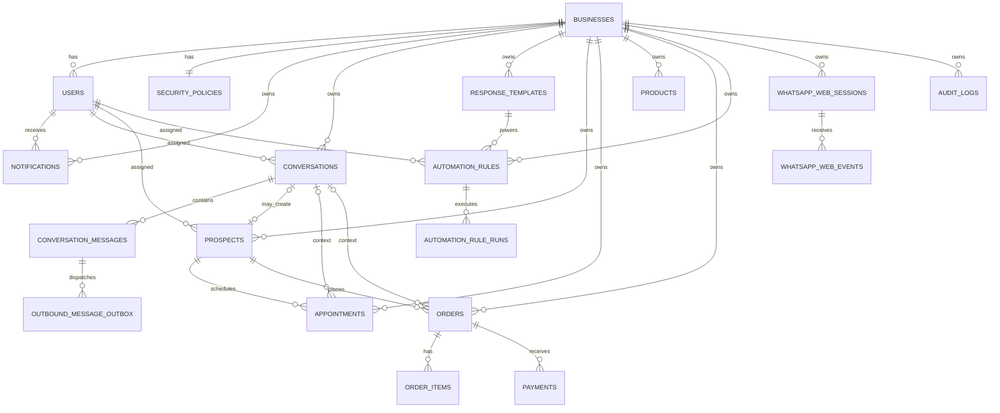

# DATA_MODEL

## Objetivo

Definir las entidades, relaciones y restricciones principales de Fase 1. Este documento no impone nombres finales de columnas auxiliares, pero si fija el modelo conceptual y las invariantes de negocio.

## Principios de modelado

- Una empresa por despliegue, pero todas las entidades operativas persisten `business_id`.
- Todas las consultas de negocio filtran por `business_id`.
- Identificadores primarios: `UUID`.
- Fechas de auditoria: `created_at`, `updated_at` en UTC.
- Soft delete por `active` o `status`; evitar borrado fisico.
- Entidades JPA no se exponen al frontend; siempre via DTOs.

## Campos compartidos

### BaseEntity

- `id`
- `created_at`
- `updated_at`

### BusinessScopedEntity

- `id`
- `business_id`
- `created_at`
- `updated_at`

## Entidades principales

### businesses

Representa la empresa unica del despliegue y sus datos corporativos.

Campos principales:

- `id`
- `code`
- `company_name`
- `business_name`
- `timezone`
- `currency`
- `contact_email`
- `support_phone`
- `address`
- `active`

### users

Usuarios autenticados de la plataforma.

Campos principales:

- `id`
- `business_id`
- `first_name`
- `last_name`
- `email`
- `phone`
- `password_hash`
- `role`
- `timezone`
- `active`
- `last_login_at`
- `failed_login_attempts`

Restricciones:

- unico por `business_id + email`
- `role` en `OWNER`, `ADMIN`, `AGENT`, `SALES`

### security_policies

Politicas configurables por empresa.

Campos principales:

- `id`
- `business_id`
- `session_timeout_minutes`
- `password_min_length`
- `require_uppercase`
- `require_number`
- `require_symbol`
- `max_failed_login_attempts`

### refresh_tokens

Tokens de renovacion de sesion emitidos por backend.

Campos principales:

- `id`
- `business_id`
- `user_id`
- `token_hash`
- `expires_at`
- `revoked_at`
- `user_agent`
- `ip_address`

### password_reset_tokens

Tokens de recuperacion de contrasena.

Campos principales:

- `id`
- `business_id`
- `user_id`
- `token_hash`
- `expires_at`
- `consumed_at`

### notifications

Centro basico de notificaciones internas.

Campos principales:

- `id`
- `business_id`
- `user_id`
- `type`
- `status`
- `title`
- `body`
- `related_entity_type`
- `related_entity_id`
- `read_at`

### conversations

Conversaciones de WhatsApp administradas por el negocio.

Campos principales:

- `id`
- `business_id`
- `channel_type`
- `customer_name`
- `customer_phone`
- `assigned_user_id`
- `prospect_id` nullable
- `status`
- `unread_count`
- `last_message_at`
- `last_message_preview`
- `opened_at`
- `closed_at`

Reglas:

- puede existir sin `prospect_id`
- `channel_type` fijo en `WHATSAPP` para Fase 1

### conversation_messages

Mensajes del hilo de conversacion.

Campos principales:

- `id`
- `business_id`
- `conversation_id`
- `direction` (`INBOUND`, `OUTBOUND`)
- `message_type` (`TEXT`)
- `body`
- `status` (`RECEIVED`, `QUEUED`, `SENT`, `DELIVERED`, `READ`, `FAILED`)
- `external_message_id` nullable
- `provider_event_id` nullable
- `sent_at`
- `received_at`
- `failed_at` nullable
- `error_code` nullable

### response_templates

Plantillas reutilizables de respuesta.

Campos principales:

- `id`
- `business_id`
- `name`
- `category`
- `body`
- `active`

Restricciones:

- unico por `business_id + name`

### prospects

Prospectos comerciales.

Campos principales:

- `id`
- `business_id`
- `source_type` (`MANUAL`, `CONVERSATION`)
- `conversation_id` nullable
- `first_name`
- `last_name`
- `phone`
- `normalized_phone`
- `email` nullable
- `stage`
- `notes`
- `assigned_user_id`
- `active`

Restricciones:

- recomendado unico por `business_id + normalized_phone` cuando `active = true`

### appointments

Citas comerciales u operativas.

Campos principales:

- `id`
- `business_id`
- `prospect_id` nullable
- `conversation_id` nullable
- `subject`
- `status`
- `starts_at`
- `duration_minutes`
- `location`
- `notes`
- `completed_at` nullable

### products

Catalogo basico de productos o servicios.

Campos principales:

- `id`
- `business_id`
- `name`
- `sku`
- `category`
- `description`
- `price`
- `active`

Restricciones:

- unico por `business_id + sku`

### orders

Pedidos emitidos a prospectos o clientes.

Campos principales:

- `id`
- `business_id`
- `prospect_id`
- `conversation_id` nullable
- `status`
- `payment_status`
- `subtotal_amount`
- `discount_amount`
- `total_amount`
- `paid_amount`
- `balance_due`
- `currency`
- `due_date` nullable
- `notes`

### order_items

Detalle de lineas del pedido.

Campos principales:

- `id`
- `business_id`
- `order_id`
- `product_id`
- `product_name_snapshot`
- `sku_snapshot`
- `quantity`
- `unit_price`
- `line_total`

### payments

Pagos registrados sobre pedidos.

Campos principales:

- `id`
- `business_id`
- `order_id`
- `amount`
- `method`
- `paid_at`
- `reference`
- `notes`

### automation_rules

Reglas simples de automatizacion.

Campos principales:

- `id`
- `business_id`
- `name`
- `trigger_type`
- `keyword` nullable
- `delay_minutes`
- `action_type`
- `template_id` nullable
- `assigned_user_id` nullable
- `active`

Reglas:

- `template_id` obligatorio si `action_type = SEND_TEMPLATE`
- `keyword` obligatorio si `trigger_type = KEYWORD_MATCH`

### automation_rule_runs

Historial de ejecuciones reales o simuladas.

Campos principales:

- `id`
- `business_id`
- `rule_id`
- `conversation_id` nullable
- `run_type` (`TEST`, `LIVE`)
- `status`
- `input_payload`
- `result_payload`
- `executed_at`

### whatsapp_web_sessions

Estado de la sesion conectada al adaptador experimental.

Campos principales:

- `id`
- `business_id`
- `session_key`
- `status`
- `phone_number` nullable
- `last_qr_code` nullable
- `last_event_at` nullable
- `connected_at` nullable
- `disconnected_at` nullable

Restricciones:

- una sola sesion activa por `business_id`

### whatsapp_web_events

Registro de eventos recibidos desde `whatsapp-web-service`.

Campos principales:

- `id`
- `business_id`
- `session_id`
- `delivery_id`
- `event_type`
- `payload`
- `received_at`
- `processed_at` nullable
- `processing_status`

Restricciones:

- unico por `delivery_id`

### outbound_message_outbox

Cola transaccional sencilla para salida de mensajes.

Campos principales:

- `id`
- `business_id`
- `conversation_id`
- `message_id`
- `channel_type`
- `payload`
- `status` (`PENDING`, `SENT`, `FAILED`)
- `attempt_count`
- `next_attempt_at`
- `last_error` nullable

### audit_logs

Auditoria minima contractual.

Campos principales:

- `id`
- `business_id`
- `actor_user_id` nullable
- `action_type`
- `entity_type`
- `entity_id`
- `summary`
- `metadata`
- `occurred_at`

## Relaciones principales

- `businesses 1 - N users`
- `businesses 1 - 1 security_policies`
- `users 1 - N notifications`
- `users 1 - N conversations` como `assigned_user_id`
- `conversations 1 - N conversation_messages`
- `conversations 0..1 - 1 prospects`
- `prospects 1 - N appointments`
- `prospects 1 - N orders`
- `orders 1 - N order_items`
- `orders 1 - N payments`
- `response_templates 1 - N automation_rules`
- `automation_rules 1 - N automation_rule_runs`
- `whatsapp_web_sessions 1 - N whatsapp_web_events`

## Enums sugeridos

### UserRole

- `OWNER`
- `ADMIN`
- `AGENT`
- `SALES`

### ConversationStatus

- `OPEN`
- `PENDING`
- `CLOSED`

### ProspectStage

- `NEW`
- `CONTACTED`
- `QUALIFIED`
- `PROPOSAL`
- `WON`
- `LOST`

### AppointmentStatus

- `SCHEDULED`
- `RESCHEDULED`
- `COMPLETED`
- `CANCELLED`

### OrderStatus

- `DRAFT`
- `CONFIRMED`
- `CANCELLED`
- `COMPLETED`

### PaymentStatus

- `PENDING`
- `PARTIALLY_PAID`
- `PAID`
- `OVERDUE`

### NotificationStatus

- `UNREAD`
- `READ`

### WhatsAppWebSessionStatus

- `DISCONNECTED`
- `QR_PENDING`
- `CONNECTED`
- `ERROR`

## Diagrama de relaciones

## Invariantes obligatorias

- Ninguna entidad operativa se crea sin `business_id`.
- Ningun repositorio de dominio consulta sin scope de `business_id`.
- Un pago no puede exceder el `balance_due` del pedido.
- Un pedido debe tener al menos un `order_item`.
- Una cita debe programarse en fecha futura al crear o reprogramar.
- Una regla de automatizacion en modo prueba nunca llama al canal real.
- `whatsapp_web_sessions` no reemplaza la fuente de verdad del negocio; solo refleja estado del adaptador.
