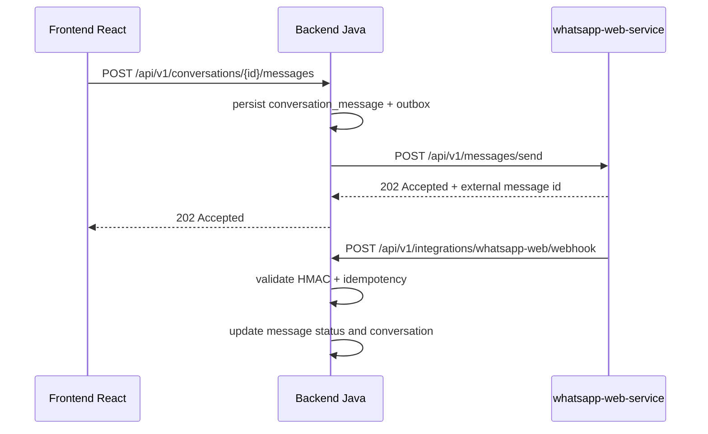

# WHATSAPP_WEB_ADAPTER

## Objetivo

Definir el contrato de integracion entre el backend Java y `whatsapp-web-service` para Fase 1.

## Regla critica

- No usar WhatsApp Business Platform en Fase 1.
- `whatsapp-web-service` se usa solo como adaptador experimental para demos, validacion temprana y pilotos controlados.
- El backend Java nunca depende del runtime de WhatsApp Web dentro del dominio. Depende solo de interfaces internas.

## Principio arquitectonico

El backend Java depende de una interfaz interna llamada `MessagingChannel`.

```text
Frontend React
    |
    v
Backend Java (dominio y aplicacion)
    |
    +--> MessagingChannel (puerto interno)
            |
            v
     Adaptador WhatsApp Web externo
            |
            v
      whatsapp-web-service
```

## Responsabilidades

### Backend Java

- conservar la fuente de verdad de conversaciones, mensajes, prospectos, pedidos y citas;
- decidir cuando enviar mensajes;
- persistir outbox, auditoria y estado funcional;
- exponer endpoints seguros al frontend;
- recibir webhooks firmados desde `whatsapp-web-service`.

### whatsapp-web-service

- encapsular la sesion experimental de WhatsApp;
- exponer operaciones tecnicas de sesion, QR y envio;
- notificar al backend cambios de sesion y mensajes entrantes;
- no ejecutar reglas de negocio;
- no guardar la verdad funcional del CRM.

## Puerto interno esperado en backend

### `MessagingChannel`

Operacion minima:

- `send(outboundMessage)`

Entradas minimas:

- `businessId`
- `recipientPhone`
- `body`

Salida minima:

- `channelType`
- `externalMessageId`
- `status`
- `acceptedAt`

### Otros puertos internos recomendados

- `WhatsAppWebSessionGateway`
  - `getStatus()`
  - `connect()`
  - `refreshQr()`
  - `disconnect()`
- `InboundChannelEventHandler`
  - procesa eventos de webhook con idempotencia

## Flujo de salida de mensaje

1. Un caso de uso del backend crea el mensaje saliente y lo asocia a una conversacion.
2. El backend persiste el mensaje en `conversation_messages`.
3. El backend persiste el trabajo en `outbound_message_outbox`.
4. Un dispatcher llama al puerto `MessagingChannel`.
5. El adaptador HTTP del backend llama a `whatsapp-web-service`.
6. `whatsapp-web-service` devuelve `acceptedAt`, `messageId` y `status`.
7. El backend actualiza el mensaje y el outbox.
8. Los cambios de entrega posteriores llegan por webhook firmado.

## Flujo de mensaje entrante

1. `whatsapp-web-service` recibe un mensaje desde WhatsApp.
2. `whatsapp-web-service` firma el evento con HMAC.
3. `whatsapp-web-service` hace `POST` al webhook del backend.
4. El backend valida firma, timestamp e idempotencia.
5. El backend crea o actualiza la conversacion.
6. El backend persiste el mensaje entrante.
7. El backend recalcula `unread_count`, `last_message_at` y notificaciones.

## Flujo de sesion WhatsApp Web

1. El frontend llama al backend, nunca al servicio Node.
2. El backend llama a `whatsapp-web-service` para pedir estado, QR, conexion o desconexion.
3. `whatsapp-web-service` responde con estado tecnico.
4. El backend traduce esa respuesta a DTOs aptos para la UI.
5. Eventos asincronos de sesion tambien llegan por webhook firmado.

## Endpoints esperados en whatsapp-web-service

Estos endpoints pertenecen al adaptador Node, no al frontend:

| Metodo | Ruta | Uso |
| --- | --- | --- |
| `GET` | `/health` | Salud tecnica del adaptador. |
| `GET` | `/api/v1/session/status` | Consultar estado de sesion, telefono y ultimo QR. |
| `POST` | `/api/v1/session/connect` | Inicializar o reintentar conexion. |
| `POST` | `/api/v1/session/refresh-qr` | Solicitar nuevo QR. |
| `POST` | `/api/v1/session/disconnect` | Cerrar sesion actual. |
| `POST` | `/api/v1/messages/send` | Enviar mensaje de texto saliente. |

## Endpoints esperados en backend para WhatsApp Web

### Frontend -> backend

| Metodo | Ruta | Uso |
| --- | --- | --- |
| `GET` | `/api/v1/whatsapp-web/status` | Estado consumible por UI. |
| `POST` | `/api/v1/whatsapp-web/connect` | Solicita conexion. |
| `POST` | `/api/v1/whatsapp-web/refresh-qr` | Solicita nuevo QR. |
| `POST` | `/api/v1/whatsapp-web/disconnect` | Solicita desconexion. |

### whatsapp-web-service -> backend

| Metodo | Ruta | Uso |
| --- | --- | --- |
| `POST` | `/api/v1/integrations/whatsapp-web/webhook` | Evento firmado de sesion o mensaje. |

## Seguridad entre backend y whatsapp-web-service

### Backend -> whatsapp-web-service

- header `X-API-Key`
- timeout corto
- retry controlado solo en operaciones seguras
- circuit breaker o fallback simple recomendado

### whatsapp-web-service -> backend

Headers requeridos:

- `X-WhatsApp-Web-Timestamp`
- `X-WhatsApp-Web-Signature`
- `X-WhatsApp-Web-Delivery-Id`

Reglas:

- firma HMAC con secreto compartido;
- rechazar eventos fuera de ventana de tiempo tolerada;
- rechazar eventos repetidos por `delivery_id`.

## Payload base del webhook

```json
{
  "eventType": "MESSAGE_RECEIVED",
  "deliveryId": "6d4b66b9-2d71-4713-a0d4-444444444444",
  "occurredAt": "2026-05-23T20:15:30Z",
  "sessionKey": "demo-sales",
  "payload": {
    "externalMessageId": "wamid-123",
    "from": "+56911112222",
    "to": "+56999998888",
    "body": "Hola, quiero una cotizacion"
  }
}
```

## Event types soportados en Fase 1

- `SESSION_STATUS_CHANGED`
- `QR_UPDATED`
- `MESSAGE_RECEIVED`
- `MESSAGE_ACK_UPDATED`

## Mapeo de estados

### Estado tecnico de sesion

- `DISCONNECTED`
- `QR_PENDING`
- `CONNECTED`
- `ERROR`

### Estado de entrega de mensaje

- `QUEUED`
- `SENT`
- `DELIVERED`
- `READ`
- `FAILED`

## Reglas de resiliencia

- El backend debe tolerar que `whatsapp-web-service` no este disponible.
- Un fallo del adaptador no debe romper la integridad de conversaciones ya persistidas.
- Los mensajes salientes fallidos quedan en outbox para reintento.
- Los webhooks deben ser idempotentes.
- El backend debe poder reconstruir estado de sesion desde `GET /api/v1/session/status`.

## Reglas de observabilidad

- Registrar `delivery_id` en logs de webhook.
- Registrar `external_message_id` en mensajes entregados o fallidos.
- Auditar:
  - conexion WhatsApp Web;
  - desconexion WhatsApp Web;
  - QR regenerado;
  - envio saliente;
  - fallo de entrega.

## Restricciones de Fase 1

- Solo mensajes de texto.
- Sin multimedia.
- Sin audio.
- Sin documentos.
- Sin multiples sesiones por empresa.
- Sin automatizaciones ejecutadas dentro de `whatsapp-web-service`.
- Sin acceso directo del frontend al servicio Node.

## Secuencia recomendada



## Criterio de aceptacion contractual

- Si en el futuro se reemplaza WhatsApp Web, el dominio no cambia.
- El reemplazo solo afecta la implementacion del puerto `MessagingChannel` y gateways tecnicos relacionados.
